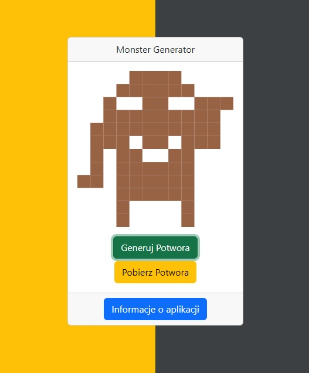

# :desktop_computer: MonsterGenerator

The application uses the pixelencounter API to generate random monsters, which are then presented to the user. The user has the option to download the generated monster.

## :framed_picture: Screenshots

## :joystick: Demo

https://kamilkeder.github.io/MonsterGenerator/

## :e-mail: Feedback

If you have any feedback, please reach out to me at kontaktkkeder@gmail.com
